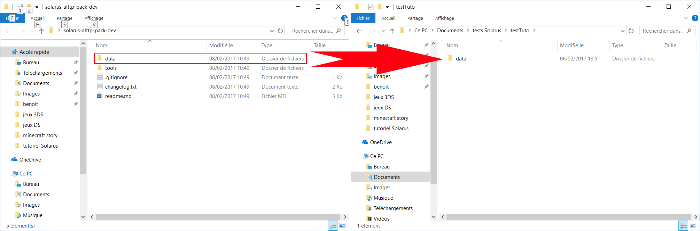
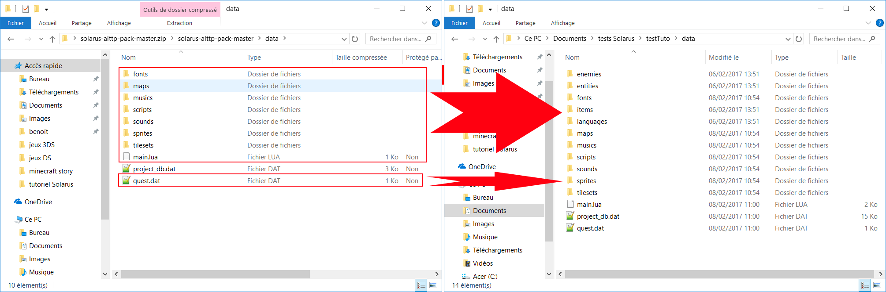

## Ajout de ressources prévues pour Solarus ##

Bon, vous avez une quête prête à être utilisée, maintenant, il vous faut des ressources.

Les ressources, c'est l'ensemble de toutes les données visuelles (images de fond, personnages, etc) et sonores (musiques et effets) qui seront dans votre projet.

Solarus étant un logiciel qui permet de jouer à des jeux zelda-like, autant utiliser directement des ressources venant des jeux Zelda.

### 1) Téléchargement du pack Solarus pour Zelda 3 ###

Pour commencer, on va aller télécharger les ressources dont on vient de parler. Elles sont disponibles [ici](https://github.com/solarus-games/solarus-alttp-pack/archive/dev.zip).

Une fois cette archive téléchargée et extraite, vous aurez deux possibilités pour avoir une quête avec ces ressources.

A) Créer une toute nouvelle quête

La première possibilité sera de créer une toute nouvelle quête. Créez donc un nouveau dossier, qui contiendra votre nouvelle quête, puis copiez le dossier "data" de l'archive directement dans ce dossier.

Vous devrez ensuite lancer l'éditeur de quête, puis sélectionner "fichier -> ouvrir une quête" avant de préciser le dossier que vous venez de créer.

Attention, en préparant votre quête de cette manière, vous devrez spécifier un dossier pour les sauvegardes de votre jeu avant de l'exécuter, sinon, votre quête ne se lancera pas.
Pour celà, ouvrez les propriétés de votre quête et donnez un nom à ce répertoire dans l'encadré correspondant. N'oubliez pas de sauvegarder les propriétés avant de l'exécuter.

B) Ajouter les textures à une quête existante

Pour ajouter les textures à une quête déjà créée, vous devrez copier le contenu du dossier "data" de l'archive, en ommettant le fichier project_db.dat. Vous devez donc copier ces fichiers de cette manière:

Ensuite, démarrez l'éditeur, et ouvrez votre quête.
Dans l'arbre de la quête (à gauche de la fenêtre), vous verrez plusieurs fichiers avec une icone de point d'interrogation. Vous devrez faire un clic droit sur ces fichiers, et les ajouter au projet via l'option correspondante. Cette méthode est assez longue, surtout pour des packs de ressources conséquents.

Attention, en préparant votre quête de cette manière, vous devrez spécifier un dossier pour les sauvegardes de votre jeu avant de l'exécuter, sinon, votre quête ne se lancera pas.
Pour celà, ouvrez les propriétés de votre quête et donnez un nom à ce répertoire dans l'encadré correspondant. N'oubliez pas de sauvegarder les propriétés avant de l'exécuter.