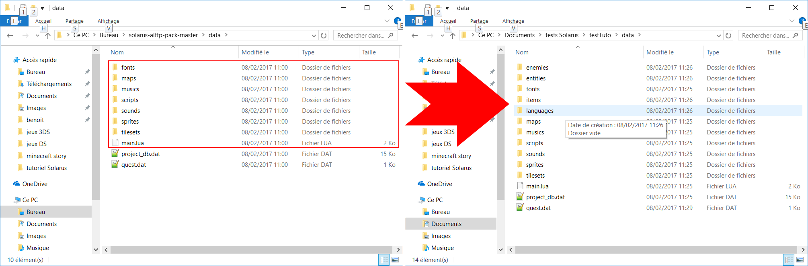

# Chapitre 2 - Ajout de ressources Zelda prévues pour Solarus

Les ressources, c'est l'ensemble de toutes les données visuelles (décors, sprites de personnages, etc) et sonores (musiques et sons) qui seront dans votre projet.

Lorsque vous créez une [nouvelle quête](../001.getting_started/chapter.md) avec Solarus Quest Editor, votre jeu contient par défaut un ensemble de ressources sous licence libre.
Solarus étant un logiciel qui permet de jouer à des jeux Zelda-like, vous pouvez développer votre jeu soit avec le pack de ressources libres Solarus, soit avec des ressources provenant des jeux Zelda, soit avec vos propres ressources originales.

Dans cette série de tutoriels, la plupart des exemples utilisent des ressources venant des jeux Zelda. Cependant, la plupart des tutoriels restent valables quel que soit votre choix de ressources.

Ce tutoriel explique comment utiliser le pack de resources de Zelda A Link to the Past dans votre projet. Cependant, la procédure est similaire pour importer des ressources venant d'autres projets Solarus.

## 1) Téléchargement du pack Solarus pour Zelda A Link to the Past

Pour commencer, on va aller télécharger les ressources dont on vient de parler. Elles sont disponibles [ici](https://github.com/solarus-games/solarus-alttp-pack/archive/master.zip).

Une fois cette archive téléchargée et extraite, vous aurez deux possibilités pour avoir une quête avec ces ressources, selon que vous ayiez déjà une quête avec des données ou non.

### A) Créer une toute nouvelle quête

La première possibilité sera de créer une toute nouvelle quête. Créez donc un nouveau dossier, qui contiendra votre nouvelle quête, puis copiez le dossier `data` de l'archive directement dans ce dossier.

Vous devrez ensuite lancer l'éditeur de quête, puis sélectionner "Fichier -> Ouvrir une quête" avant de préciser le dossier que vous venez de créer.

Attention, en préparant votre quête de cette manière, vous devrez spécifier un dossier pour les sauvegardes de votre jeu avant de l'exécuter, sinon, votre jeu ne se lancera pas.
Pour cela, ouvrez les propriétés de votre quête (Fichier -> Propriétés de la quête) et donnez un nom à ce répertoire dans l'encadré correspondant. Le nom doit être unique afin d'éviter tout conflit avec les autres jeux Solarus qui pourraient être installés chez le joueur. N'oubliez pas de sauvegarder les propriétés avant d'exécuter votre quête.

### B) Ajouter les ressources à une quête existante

Avant toute chose, faites toujours une sauvegarde de vos données !

Pour ajouter les ressources Zelda à une quête déjà existante, vous devrez copier le contenu du dossier `data` de l'archive, en ommettant les fichiers `project_db.dat` (la liste des ressources de votre quête, car vous ne voulez pas perdre vos ressources existantes) et `quest.dat` (les propriétés de votre quête comme le titre et le dossier des sauvegardes). Si vous souhaitez tout récupérer, vous pouvez donc copier les fichiers du dossier `data` de cette manière :

Il est également possible de ne prendre que les ressources que vous souhaitez, surtout si vous avez déjà vos propres scripts et vos propres ressources présentes. Pour cela, examinez les sous-dossiers de `data` pour ne copier que les fichiers qui vous intéressent.

Dans tous les cas, après avoir copié les fichiers, démarrez l'éditeur et ouvrez votre quête.
Dans l'arbre de la quête (à gauche de la fenêtre), vous verrez plusieurs fichiers avec une icône de point d'interrogation. Il s'agit des fichiers que Solarus Quest Editor détecte sur le disque mais qui ne font pas encore partie de votre projet. Vous devrez faire un clic droit sur ces fichiers, et les ajouter au projet via l'option correspondante. Cette méthode peut être assez fastidieuse, surtout pour des packs de ressources conséquents.

La prochaine version de Solarus (1.6) simpliera cette tâche en permettant d'importer pour vous des ressources venant d'autres projets.
