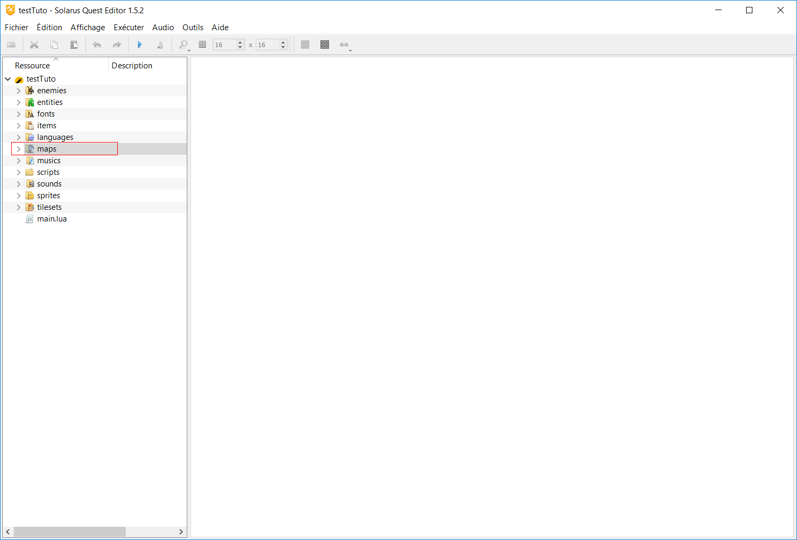
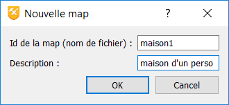
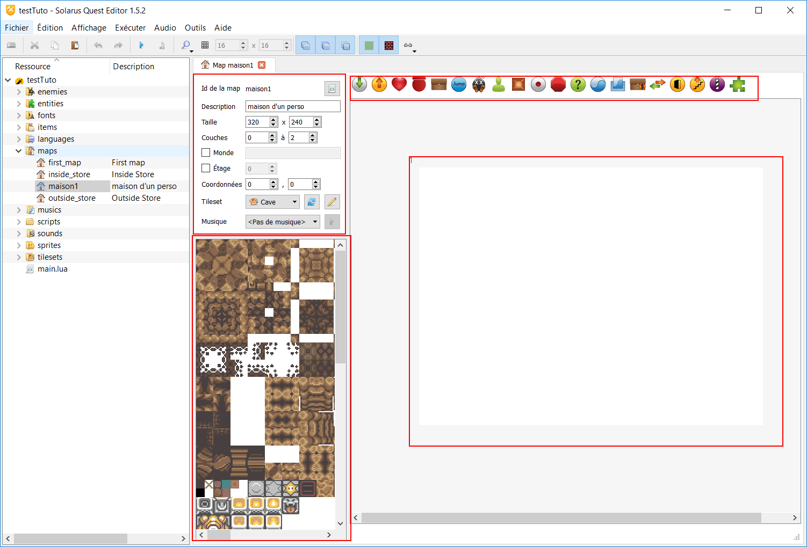
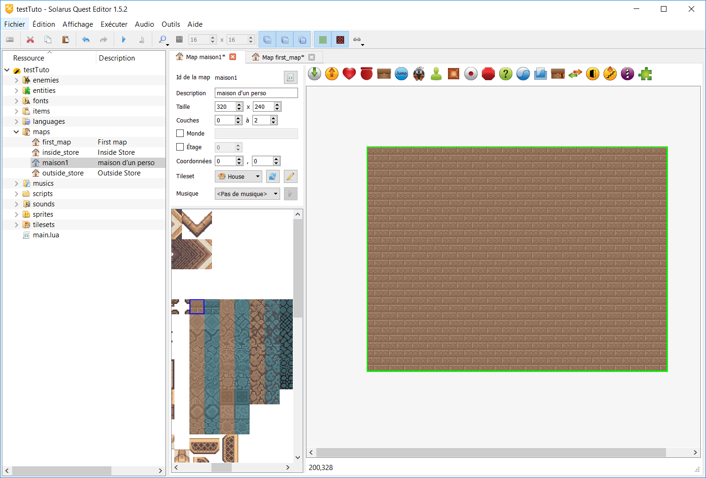
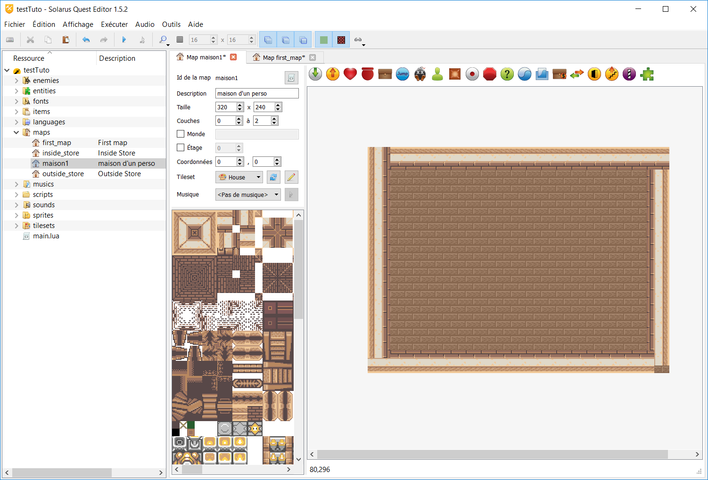
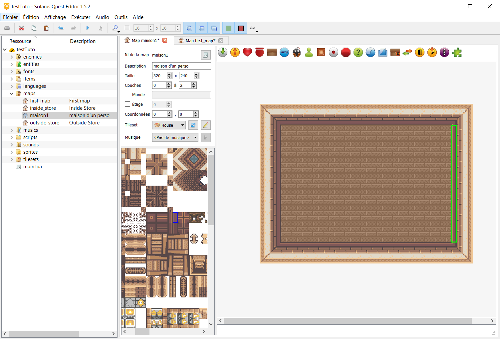

# Chapitre 3 - L'éditeur de maps #

Si vous avez déjà tenté d'éxécuter une quête, vous avez du apercevoir un personnage pouvant se déplacer à l'intérieur d'une salle vide. Cette salle est générée à partir d'un type de ressource nommé les maps. Ce que nous allons faire à présent, à partir des ressources ajoutées au projet dans le chapitre précédent, c'est de créer nous aussi une map, une zone dans laquelle notre personnage pourra se déplacer.

/!\/!\/!\ Ce chapitre et les suivants utiliseront les ressources que nous avons importées dans le chapitre précédent. /!\/!\/!\

## I) Initialisation d'une map ##

Dans l'arbre de votre quête, vous aurez surement remarqué la présence de nombreuses ressources (sprites, sons, musiques, ...). Nous allons nous intéresser au dossier map visible à la racine du projet.

Faites donc un clic droit dessus, et sélectionnez l'option "nouvelle map".

Une nouvelle fenêtre va alors s'ouvrir, vous demandant un id pour la map, ainsi qu'une description de celle-ci. Par exemple, si l'on voulait créer la map d'une maison, on pourrait utiliser l'ID `maison1` et la description `maison d'un personnage`, ce qui donnerait ça :

Une fois ces données remplies, validez votre sélection. Vous allez avoir un nouvel onglet que va s'ouvrir, vous permettant de modifier à loisir les données de votre nouvelle ressource :

Si vous n'avez pas importé les données du chapitre précédent, vous ne devriez pas avoir d'image au centre de la fenêtre. Importez un tileset pour corriger ça.

Dans cet onglet, on peut distinguer 4 zones distinctes, représentées par les quatres cadres rouges.

- En haut à gauche, les données de la map : sa description, ses dimensions en pixels (320*240 par défaut, la taille de la fenêtre), le nombre de couches sur lesquelles vous pourrez superposer vos motifs, le tileset utilisé, etc.
- En bas à gauche, l'image des tiles du tileset utilisé, que vous allez utiliser pour créer votre map.
- En haut à droite, des entités légèrement différentes, qui vous permettront par exemple de créer des portes ou de disposer des trésors ou des ennemis.
- Enfin, en bas à droite, la surface de dessin de votre map, là où vous allez directement la mettre en forme.

## 2) Création d'un décor ##

Pour le moment, votre map est complètement vierge. Il vas nous falloir y remédier. Pour cela, nous allons utiliser deux des quatre zones citées précédemment : la vue graphique du tileset et la surface de dessin.

Si vous essayez de cliquer dans la zone de dessin d'une map déjà existante, une partie du dessin va s'encadrer en vert. Chacune de ces parties s'appelle un "motif de tiles", composé d'une partie du tileset, répétée un certain nombre de fois. Par exemple, dans le tileset, les images des murs à droite et à gauche des salles existantes ne font que 16 pixels de haut, mais en les répétant, on peut créer un mur de 160 pixels de haut, par exemple.

Dans toute la suite de ce chapitre, nous allons utiliser le tileset nommé "House", mais vous êtes libre d'utiliser celui que vous voulez.

Pour ajouter un motif à votre map, il vous faudra donc le sélectionner dans la vue du tileset, puis le disposer à votre convenance sur la surface de dessin. Si nous essayons de créer un sol, pour ne plus avoir de surface "vide" (sans dessin dessus), on devrait obtenir quelque chose comme ceci :

Il existe plusieurs motifs de sol, libre à vous de choisir celui que vous voulez.

**astuces**

- Garder le clic enfoncé vous permet de redimensionner votre motif. Le sélectionner et appuyer sur la touche `r` donne le même résultat.
- faire un clic droit pour poser un motif vous permet d'en recréer un autre immédiatement, pratique pour les motifs dispersés dans la salle (des lanternes, par exemple).
- Vous pouvez également déplacer les motifs que vous avez disposé sur votre map en faisant un cliquer-glisser (drag'n drop) sur ce motif, et en sélectionner plusieurs en appuyant sur la touche `ctrl`.
- Faire un clic molette vous permet de vous déplacer dans la zone de dessin ou la vue du tileset plus facilement

### Exercice : créer sa propre map ###

Maintenant que vous savez comment vous y prendre pour disposer les motifs de tiles correctement, essayez de faire en sorte que votre salle soit fermée par quatres murs, de manière à ce qu'on ne voie pas de coupure nette entre eux.
Voici un exemple ou les murs ne sont pas bien reliés :

Pour corriger celà, il faut penser à utiliser les tiles de "coins", qui vous permettent de corriger ces défauts.

Exemple de corrigé :

Ici, les murs sont bien reliés entre eux, on ne voit plus de cassure aux quatre coins de la map.

## 3) Les tiles dynamiques ##

Maintenant que les tiles "statiques" sont placées, nous allons pouvoir parler rapidement des tiles dynamiques, 

/!\ Nous n'allons pas voir en détail tous les types de tiles dynamiques ici, mais principalement ceux des destinations.

Les tiles dynamiques sont des tiles pouvant être modifiées par le programme, aussi bien au niveau de leur position que de leur apparence.

Par exemple, un item laissé au sol est une tile dynamique, qui influera par la suite sur l'équipement possédé. Un personnage est également une tile dynamique avec laquelle on pourra interagir.

Comme dit plus haut, les tiles dynamiques que nous verrons ici seront seulement celles des destinations, c'est à dire celles ayant l'image encadrée en rouge ici:

Une destination correspond à la position qu'aura le héros après un changement de zone ou au lancement du jeu.

Ajoutez donc une nouvelle destination dans votre nouvelle map, pour pouvoir démarrer directement dessus.

Changer la destination d'origine du jeu ne se gère cependant pas seulement en ajoutant cette destination. Ouvrez le fichier  `game_manager.lua`, et ajoutez la ligne suivante entre les lignes 13 et 14 en remplaçant "maison1" par le nom de la map que vous venez de créer:

`game:set_starting_location("maison1")`

Si tout s'est bien passé, vous devriez arriver sur la map que vous avez créée tout au long de ce chapitre, à l'endroit exact où se situe votre tile de destination.

## 4) Les couches d'affichage ##

Vous l'aurez probablement déjà remarqué dans ce type de jeu, il arrive parfois que le personnage passe derrière certains éléments du décor (une maison, un arbre, et bien plus encore). Cet affichage est géré par le système de couches.

Par défaut, chaque motif de tiles a une couche d'affichage prédéfinie. Cette couche détermine la position de ce tile en particulier par rapport au héros.

Pour donner un exemple simple, le héros est à la couche 0.5, les sols sont donc à la couche 0 et les feuillages des arbres, les toits de maisons ou encore les étages intermédiaires sont aux couches 1 et 2.

Si vous voulez savoir rapidement quelles tiles sont sur une couche prédéfinie, certains boutons en haut de la fenêtre permettent d'afficher/retirer les tiles de la couche correspondante.

### Exercice de fin de chapitre ###

Pour finir cette initiation, je vous propose un petit exercice d'application : commencez par créer une nouvelle map, de la taille de votre choix, et sélectionnez le tileset "Light World" dans la liste, ainsi que la musique "Overworld" pour donner un peu plus de gaité à votre quête.

Faites un sol constitué d'herbe, et ajoutez quelques arbres dans cette zone.

Pour finir, une partie un peu plus technique : Essayez, à partir des tiles fournis, d'assembler une maison ailleurs dans la map.

Voici un exemple du rendu que vous pourriez avoir :

Si vous avez un rendu semblable, vous pouvez sans peine passer à l'étape suivante. 