# Chapitre 4 - Les terrains #

Nous allons maintenant nous intéresser à une caractéristique importante des tiles : les terrains.

Chaque motif de tile possède une caractéristique "terrain" qui permet diverses choses : un déplacement, une modification du sprite, etc. Cette caractéristique est définie dans les tilesets dont sont originaires les motifs.

##1) Modifier le terrain d'un motif de tiles##

Pour modifier un motif, vous devez accéder aux propriétés du tileset concerné. Dans la liste à gauche se trouve un dossier nommé `tilesets`, dans lequel vous pouvez trouver les données correspondantes. En ouvrant un tileset, vous arrivez sur l'écran suivant (pour le tileset `house`)
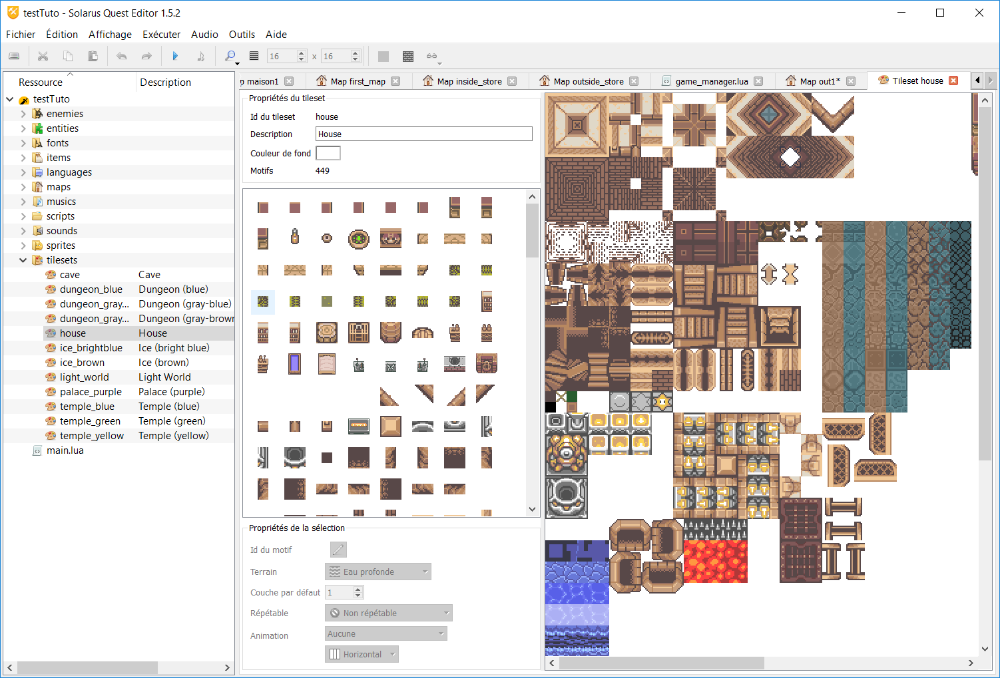

Sur cette fenêtre, vous avez, en haut à gauche, les propriétés du tileset, puis en dessous, la liste des motifs créés dessus. Tout en bas à gauche, on trouve les propriétés des motifs et finalement, à droite, l'image originale du tileset.

Lors de la sélection d'un motif dans la liste à gauche, la section en dessous se dégrise et nous permet de modifier les données du motif sélectionné. En l'occurence, c'est la donnée `terrain` qui nous intéresse.

##2) Les différents types de terrains##

En déroulant le menu de sélection du terrain, vous pouvez voir qu'il en existe beaucoup de différents (une vingtaine). Cette section décrira les propriétés de chaque type de terrain, et les modifications qu'ils apporteront aux déplacements du héros.

###a) Terrains traversables###

Les tiles avec ce terrain sont les plus courantes. Ce sont celles qui ne déclenchent aucune action particulière, et où le héros peut se déplacer librement.
#### Exemples de tiles utilisant ce terrain####

Les sols de tous types (planchers, dalles, herbe)

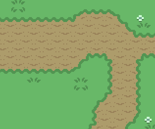

#### Symbole ####

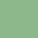

###b) Murs###

Ce type de terrain est également très répandu : il s'agit des zones sur lesquelles le héros ne peut pas se tenir. Si il essaye d'accéder à ces zones, il se retrouvera bloqué par un mur. Les projectiles (flèches, grappin, etc...) ne peuvent pas traverser ces zones non plus.

#### Exemples de tiles utilisant ce terrain####

Les murs des bâtiments, les arbres, les falaises.

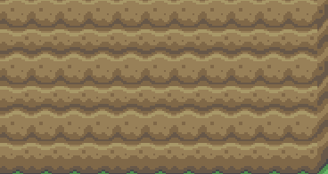
#### Symbole ####

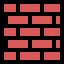

###c) Murets###

Ils sont identiques aux murs, à l'exception du cas des projectiles, qui peuvent traverser ces zones.

#### Exemples de tiles utilisant ce terrain ####

Les barrières, les arbres morts

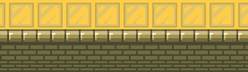

#### Symbole ####

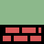
###d) murs diagonaux###

Avec certains motifs de tiles, on remarque qu'il est parfois nécessaire de faire une coupure en diagonale entre deux types de terrains. Les murs diagonaux servent à préciser cette coupure particulière à Solarus.
#### Exemples de tiles utilisant ce terrain

Certaines falaises, murs d'intérieur, etc...

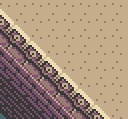 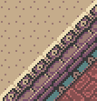 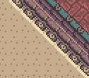 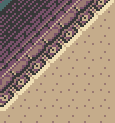

#### Symboles ####

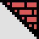 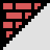 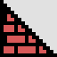 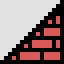

###e) murs diagonaux (eau)###

Ils représentent la même chose que les murs diagonaux classiques, mais la portion traversable est remplacée par de l'eau profonde

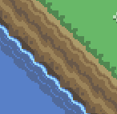 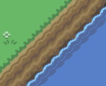  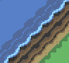
#### Symboles ####

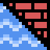 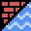 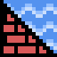 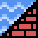
###f) Eau profonde###

Les tiles d'eau profonde sont les tiles sur lesquelles on peut voir Link nager. Dans Solarus, si le joueur n'a pas trouvé les palmes, Link se noie lorsqu'il approche de l'eau.

#### Exemples de tiles utilisant ce terrain ####

Principalement les rivières et les océans, mais également les canaux d'eau dans les donjons

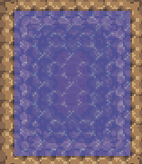

####  Symbole####

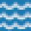

###g) Eau peu profonde###

Les tiles d'eau peu profonde modifient le sprite du héros en ajoutant un effet de vaguelettes à ses pieds. Il ralentit également un peu ses déplacements.

#### Exemples de tiles utilisant ce terrain ####

Les mares ou les flaques d'eau

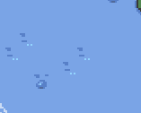

#### Symbole ####

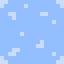

###h) Herbe###

Ce terrain est identique à celui de l'eau peu profonde, à une seule exception : l'effet aux pieds du héros ressemble à des mouvements d'herbe.

#### Exemple de tiles utilisant ce terrain ####

Les herbes hautes

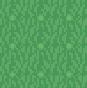

#### Symbole ####

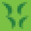

###i) Trou###

Ces terrains sont ceux qui déclenchent l'animation de chute des personnages. Une fois cette animation terminée, le personnage perd également de la vie.

#### Exemples de tiles utilisant ce terrain ####

Les sols cassés, les trous dans le sol

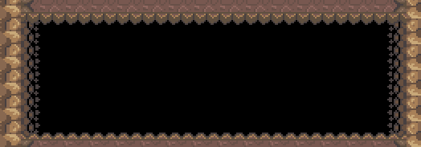

#### Symbole ####

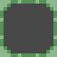

###j) glace###

Ces terrains vont faire glisser le personnage sur une plus ou moins longue distance, dans la direction de son dernier déplacement. Le changement de direction est donc plus diff)icile.

#### Exemples de tiles utilisant ce terrain ####

les sols gelés ou glissants

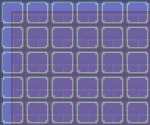

#### Symbole ####

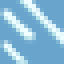

###k) Echelle###

Un terrain un peu plus basique, il se contente de baisser la vitesse du héros.

#### Exemples de tiles utilisant ce terrain ####

Les échelles ou les escaliers servant à passer d'un niveau à un autre.

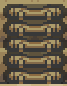

#### Symbole ####

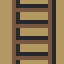

###l) Piquants###

Les tiles ayant cette propriété ne laissent pas traverser le héros et le blessent de manière répétée tant qu'il reste trop près.

#### Exemples de tiles utilisant ce terrain ####

Les picots sortant du sol

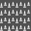

#### Symbole ####

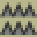

###m) Lave###

Lorsque le héros passe sur un terrain de lave, il coule et perd de la vie.

#### Exemples de tiles utilisant ce terrain ####

Les bassins de lave

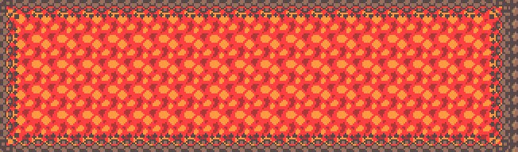

#### Symbole ####

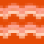

### n) Terrains "vides" ###

Les terrains vides sont utilisés pour signaler au logiciel que le motif de tile associé n'a pas de terrain prédéfini. 
Lorsqu'on crée une tile associée à un terrain vide, elle prend le terrain de la case située juste en dessous. De plus, si le héros passe sur une de ces tiles, il changera de couche d'affichage et atterrira sur la couche inférieure. 

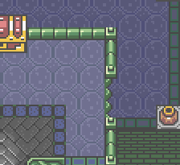

Sur cette image, par exemple, la corniche est plus élevée que le reste du sol (respectivement aux couches 1 et 0), et Link passe d'une couche à l'autre en sautant du rebord.

#### symbole ####

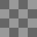

Voilà, nous avons fait le tour. Pour mieux comprendre comment tous ces terrains fonctionnent, je vous invite à tester leur fonctionnement en créant des maps et en ajoutant des éléments pour voir leurs effets directement.