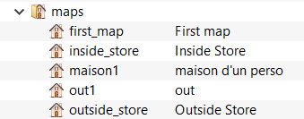
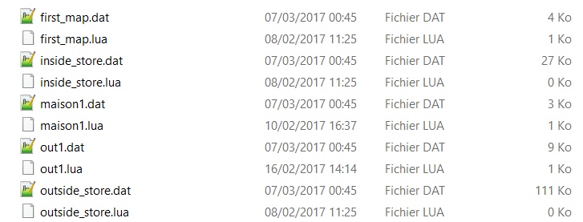
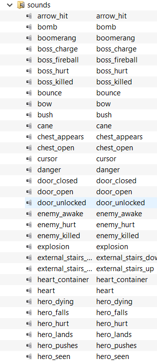
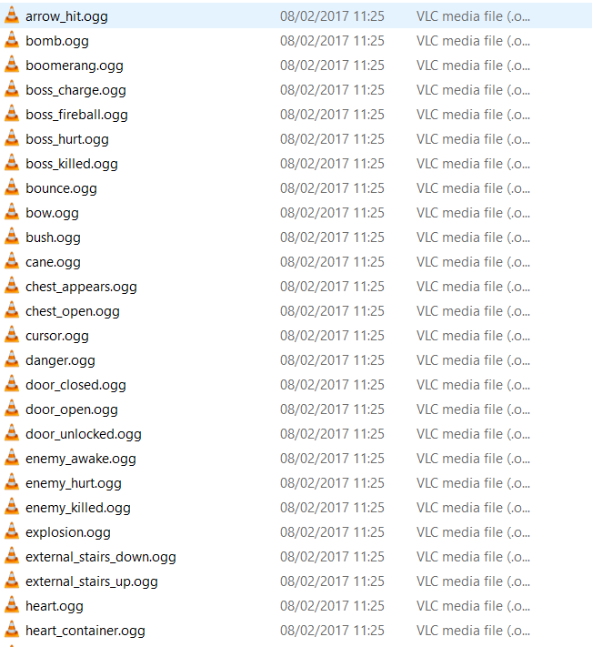
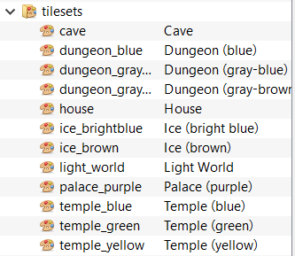
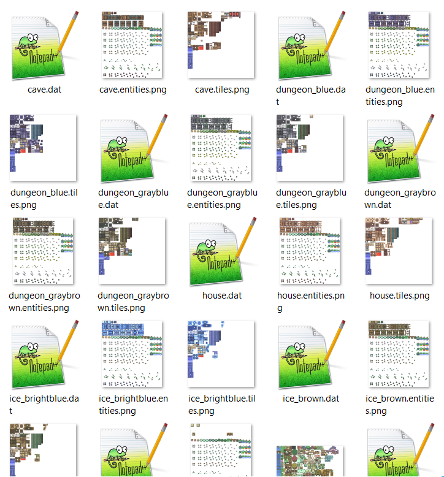
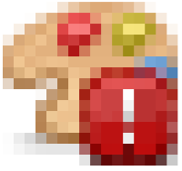

# Chapitre 5 - L'arbre de la quête #

Dans ce chapitre, nous verrons plus en détail le fonctionnement de l'arbre de la quête, ou la grande liste déroulante à gauche de l'interface Solarus.

Cette liste vous permet de voir rapidement tout le contenu de votre projet. En réalité, il s'agit d'une vue simplifiée des fichiers qui constituent votre projet.

Dans ce chapitre, nous allons comparer les éléments  visibles lorsqu'on passe par l'explorateur de fichiers de votre système et ceux affichés dans l'éditeur.

## I) Les différents types de ressources ##
### 1) Les maps ##

Dans Solarus, on ne voit pour chaque map qu'un seul élément. Cependant, en réalité, Solarus va utiliser pour chaque map 2 fichiers : un fichier `.dat` qui contient toutes les données des tiles, et un fichier `.lua` qui contient le script de la map. Nous reviendrons sur les scripts quand nous commencerons à coder nos éléments.

On voit bien la différence sur ces deux images:

### 2) Les sons ##

Pour les sons, l'affichage sous Solarus est le même que dans un gestionnaire de fichier, à une seule différence près : l'extension n'est pas visible sous Solarus.
L'extension recommandée pour les sons est l'extension `.ogg`.

###3) Les musiques ###

Les musiques sont affichées de la même manière que les sons (un fichier par ressource), l'extension des musiques peut être `.it`, `.ogg` ou `.spc`.

NOTE : En cliquant sur une ressource sonore (son ou musique), on peut l'entendre directement. Pas besoin de l'ouvrir avec un quelconque lecteur audio.

###4) Les tilesets ####

Les tilesets sont eux-aussi assez particuliers au niveau de la gestion des fichiers : il y a en réalité 3 fichiers pour chacun d'eux : un fichier `.dat` qui contient les données de l'intégralité des tiles du fichier (leurs ID, positions sur l'image, tailles, couches d'affichage, etc...) et deux fichiers `.png` : les tiles (qu'on a vu plus tôt dans ce tutoriel) et les entités (qu'on verra plus tard).
Le fichier .dat est en réalité le seule fichier que vous modifiez quand vous éditez votre tileset (en créant des motifs ou en modifiant les terrains ou les couches d'affichage).

### 5) Les sprites ##

Les sprites sont comme les tilesets, mais ils ne sont constitués que d'entités : il n'y a donc qu'un fichier `.png` pour chaque ressource de type sprite.

### 6) Les polices d'écriture (fonts)##

Ce sont les fichiers qui contiendront toutes les données graphiques des textes qui apparaitront dans votre projet (forme des lettres, position). Ce sont des fichiers `.ttf` ou `.png`.

### 7) Les fichiers Lua ##

Il s'agit de tous les autres fichiers : ils contiennent tous les scripts qui gèreront tous le déroulement du projet.

Pour chaque élément que vous créerez dans l'éditeur, celui-ci aura un nom de ressource (le nom du fichier sans son extension), une description (un message seulement visible dans l'éditeur, pour se souvenir du contenu de chaque élément) et un type (son, map, musique, etc...)

## II) Les fichiers manquants ##

### 1) Les fichiers introuvables ###

Parfois, lorsque vous ouvrirez une quête créée par quelqu'un d'autre, vous verrez certaines icones à gauche des ressources s'afficher avec un point d'exclamation encadré de rouge comme celui-ci :

Ce symbole vous indique que la ressource n'est pas présente à l'endroit où elle est signalée. Dans ce cas, il vous faudra placer le fichier correspondant au bon endroit pour corriger le problème.

### 2) Les fichiers non-ajoutés ###
Quand vous copiez un fichier dans un des dossiers de votre quête, celui-ci n'est pas automatiquement ajouté à votre projet, et est représenté par un `?` dans l'arbre de la quête. 

Pour l'ajouter, faites un clic droit sur ce fichier dans l'arbre de la quête et sélectionnez `ajouter à la quête`

### /!\ Suppression d'un fichier ###

Il est possible de retirer un fichier du projet en faisant un clic droit dessus, puis en sélectionnant `supprimer`. En faisant cela, le fichier est retiré du projet, mais est également supprimé du dossier dans lequel il se trouve.