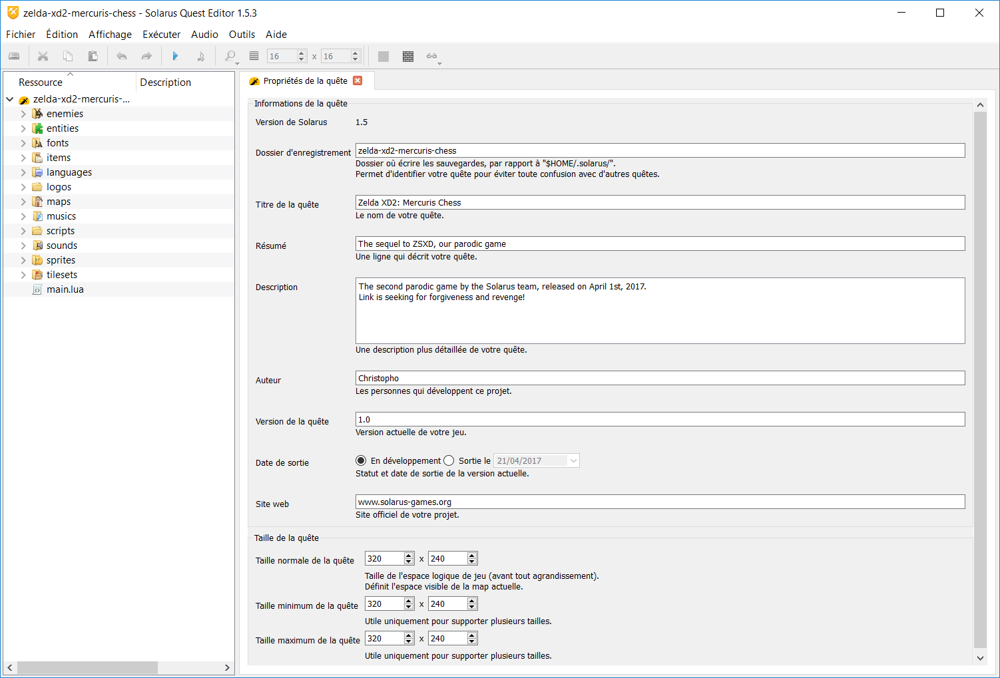

# Chapitre 6 - Les propriétés de la quête #

Comme tout programme, une quête a des propriétés spécifiques (taille de la fenêtre, répertoire de sauvegarde, etc). Dans Solarus Quest Editor, ces propriétés sont regroupées sur un seul interface, que nous allons voir plus en détail.

## I) Accéder aux propriétés ##

Pour accéder aux propriétés de la quête, il y a 3 possibilités : un raccourci clavier, l'arbre de la quête et les menus déroulants. Nous allons voir comment utiliser ces 3 possibilités.

- Raccourci clavier : Ctrl + P
- Arbre de la quête : double-cliquez sur le nom de votre quête
- Menus déroulants : Fichier -> Propriétés de la quête

Dans tous les cas, vous devriez voir un interface comme celui ci-dessous apparaitre.

Nous allons maintenant nous intéresser aux différents points concernés par cette interface, les informations de la quête

## II) Les différentes informations de la quête ##

Elles seront traitées dans l'ordre, de haut en bas.

### 1) La version ###

Il s'agit de la version de Solarus utilisée pour le projet. Celle-ci est fixe et ne pourra pas etre changée.

### 2) Le dossier d'enregistrement ###

Dans votre dossier d'utilisateur (`/home/login` sous Linux, `C:\Users\login` sous Windows), vous devriez trouver un dossier nommé .Solarus si vous avez déjà lancé une quête Solarus. Dans ce dossier, il y aura plusieurs sous-dossiers ayant chacun un nom spécifique. C'est dans ces dossiers que sont stockées les sauvegardes. Dans Solarus Quest Editor, il est possible de modifier le nom de ce dossier, afin par exemple d'avoir un nom plus clair.

### 3) Le titre de la quête ###

Vous l'aurez probablement remarqué, toute fenêtre ouverte sur votre ordinateur a un nom (Explorateur Windows, outlook, Solarus Quest Editor et j'en passe !). Dans ce cadre, vous pourrez entrer le nom que vous souhaitez donner à la fenêtre de votre quête. Ce nom sera également visible dans l'interface Solarus, qui permet de lancer les jeux créés avec ce moteur. Nous verrons où plus tard.

### 4) Le résumé ###

Il s'agit d'un résumé rapide en une ligne de votre projet, qui sera également affichée sur l'interface Solarus.

### 5) La description ###

Il s'agit plus ou moins de la même chose que le résumé, mais de manière plus détaillée.

### 6) L'auteur ###

C'est là que vous mettrez votre nom/pseudonyme, il sera également affiché dans l'interface Solarus.

### 7) La version de la quête ###

Il s'agit de la version actuelle du programme, elle pourra changer au fil des modifications apportées.

### 8) La date de sortie ###

Vous pouvez indiquer ici si votre quête est toujours en développement, ou bien si elle est finie, et depuis quelle date.

### 9) Le site web ###

Si vous avez un site web, vous pouvez le spécifier dans cette rubrique. Il sera affiché dans l'interface Solarus.

### 10) La taille de la quête ###

