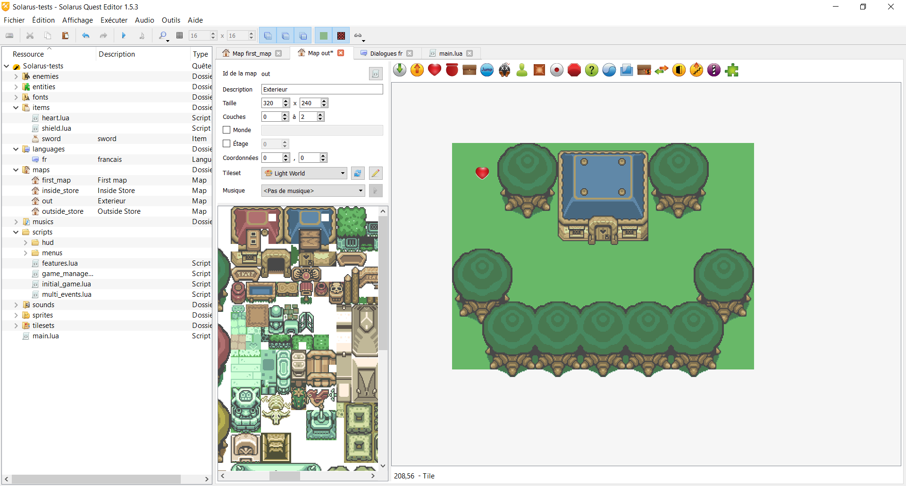
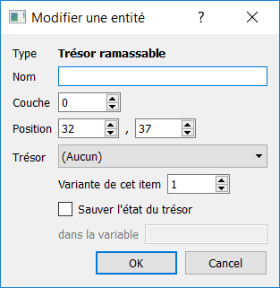
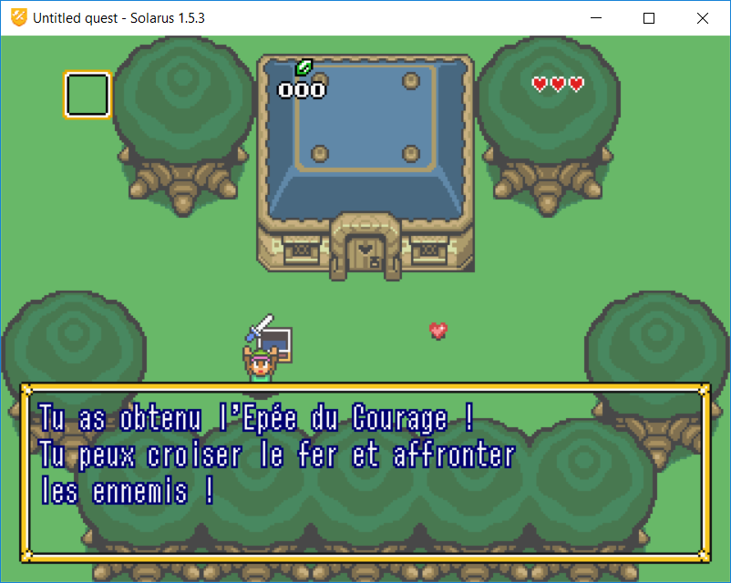

# Chapitre 8 - Les trésors #

Vous êtes encore là ? Vous avez compris le fonctionnement de base du Lua ? Bon, ben tant mieux, parce qu'à partir de maintenant, on va l'utiliser un peu plus.

Aujourd'hui, on va parler un peu plus des objets, soit par exemple l'argent, la vie, tout ça, quoi.

Dans Solarus, ces entités sont nommées des items (original, vraiment...), et leurs données sont stockées dans le dossier éponyme.

Avant de commencer, je vous conseille de télécharger [ceci](http://www.solarus-games.org/tuto/fr/basics/ep8_ressources.zip) pour avoir les ressources nécessaires à ce chapitre. Il vous faudra extraire l'archive et la copire dans le dossier data de votre quête, et ça fera l'affaire.

## I) Les items ? C'est quoi ??? ##

Les items, ce seront tous les objets disponibles dans le jeu (les armes, les collectables, les 1/4 de coeur, etc...). Dans Solarus, ce sont des scripts Lua qui sont associés à des entités de type trésor ou coffre (de manière générale, certains items peuvent être gérés différemments)

## II) Et ça marche comment tout ça ? ##

Pour utiliser un item, vous aurez principalement besoin du script qui détaille son fonctionnement.
Dans l'archive précédemment citée, vous avez donc le script de trois objets : les coeurs, le bouclier et l'épée.

Avant de les utiliser, vous aurez aussi besoin de mettre en place une langue, c'est à dire un ensemble de textes qui apparaitront dans des boites de dialogue. Solarus a été créé de manière a pouvoir facilement gérer les projets multi-langues, et offre la possibilité d'en créer plusieurs de manière simple.

### a) La création d'une langue ###

Pour créer une nouvelle langue, il vous faut aller dans l'arbre de la quête, faire un clic droit sur le dossier `languages` et créer une `Nouvelle langue`. Pour l'instant, mettez un ID "fr" et une description "Francais"

Une nouvelle fenêtre devrait s'ouvrir à droite, vous révélant l'interface des dialogues Solarus. Fermez-le tout de suite, nous allons d'abord faire quelques modifications.

### b) Importer des dialogues existants###

Vous l'aurez peut-être remarqué, il y a un autre dossier dans l'archive, nommé "languages". Copiez le contenu du sous-dossier "languages/fr/" dans le dossier fr de votre quête (dans les mêmes sous-dossiers). Vous disposerez ainsi de quelques textes déjà définis.

### b2) Créer des nouveaux dialogues ###

Pour créer des dialogues, vous devez cliquer sur la petite icone `+` à droite de la liste déjà existante, et donner un ID à votre message. Attention à la manière de le nommer ! Pour les trésors, le nom sera `_treasure.[nom de l'item].[numéro de la variante]`

La variante, ce sera par exemple le niveau de l'objet (pour une amélioration de l'épée ou du bouclier, éventuellement). Du coup, l'id du dialogue de la première épée sera `_treasure.sword.1`.

Dans le cas ou votre trésor n'a qu'une variante (les coeurs, par exemple), le numéro de la variante sera 1.

## III) Les fonctionnalités des items ##

Maintenant qu'on a ce qu'il nous faut pour travailler, on va pouvoir attaquer la partie intéressante. Commencez par importer les scripts des 3 items, et ouvrez la map que nous avons créée au chapitre 3 (oui, on a fait beaucoup de théorie ces derniers temps).

### a) Ajouter un item ramassable###

Nous avions abordé rapidement les fonctionnalités des entités dynamiques, c'est l'une de celles-ci que nous allons utiliser pour le moment, celle des trésors ramassables, symbolisée par un coeur comme celui ci-dessous. Cliquez donc dessus pour en ajouter une sur votre map.

Normalement, ça devrait donner ça : 

Maintenant, on va modifier un peu l'entité en question, afin qu'elle fasse vraiment quelque chose.

Double-cliquez donc sur le symbole (ou sélectionnez-le et appuyez sur la touche entrée), pour voir apparaitre une nouvelle fenêtre : 

Dans la liste déroulante, vous devriez pouvoir voir 3 possibilités de sélection : les coeurs, le bouclier et l'épée. Si vous ne les avez pas, vérifiez que vous les avez copiées et importées correctement.

Essayez de faire en sorte que votre entité corresponde à un coeur, puis lancez votre jeu. Si vous l'avez fait correctement, vous devriez le voir apparaitre à l'écran, et il doit disparaitre en produisant un son quand vous marchez dessus.

### a2) Les sprites ###

Vous l'aurez probablement remarqué, lorsque vous avez sélectionné le type de l'entité, l'affichage de celle-ci a été modifié. En effet, quand un trésor lui est spécifié, le logiciel va chercher dans les ressources graphiques le sprite correspondant. Ici, il s'agit du sprite `heart` contenu dans le fichier de sprites `sprites/entities/items`. N'oubliez pas d'ajouter des sprites quand vous créez de nouveaux items (on verra tout ça plus tard).

### b) Les coffres ###

Maintenant qu'on a réussi à poser des objets au sol, essayons de faire des coffres avec quelque chose à l'intérieur.

Ajoutez donc une entité coffre, dont l'icone ressemble à celle ci-dessous, sur votre map.

Vous devriez voir apparaitre un coffre avec les graphismes Zelda. Si ce n'est pas le cas, vérifiez que le sprite entities/chest est bien présent et qu'il est bien spécifié dans les propriétés de l'entité.

Ouvrez les propriétés et sélectionnez le type d'objet que vous voulez mettre dans ce coffre (de la même manière que pour le trésor ramassable).

Maintenant, lancez le jeu et ouvrez ce coffre. Si vous avez de la chance, tout fonctionnera. Sinon, vous devriez avoir une erreur rouge vous disant `Missing treasure dialog: '_treasure.sword.1'`

Ne vous en faites pas, c'est normal, car nous n'avons pas spécifié quel fichier de dialogues nous devions utiliser.

Ouvrez-donc le fichier main.lua, et regardez les deux lignes commentées au début de la fonction on_started. Décommentez-donc la seconde et modifiez-la pour utiliser le language "fr".

Maintenant, réessayez de lancer le jeu et d'ouvrir le coffre :

### c) Les objets destructibles ###

Bon, vous venez de lire le titre et vous êtes probablement en train de vous dire "mais c'est quoi ce bordel ???"

Eh bien c'est très simple : les objets destructibles, ce sont tous les objets que le héros peut détruire, à l'aide de son équipement, ou bien en soulevant l'objet pour le lancer plus loin (les pots, par exemple).

L'entité des objets destructubles, c'est l'entité représentée par cette icone : 

Son menu ressemble à ceci : 

Comme pour les objets ramassables, ils ont un nom, une couche d'affichage et une position sur la carte. Comme pour les coffres, on peut leur donner un item à révéler une fois détruits et un son lorsque cela arrive.

La particularité des objets destructibles, c'est la dernière section de la fenêtre : elle nous permet de spécifier quelles actions on peut faire avec l'objet en question et selon quels critères. 

La première ligne permet au joueur de soulever l'objet, et indique le poids de l'objet, ou l'équipement nécessaire à l'action. Par exemple, un buisson pourra être soulever sans équipement particulier et aur aun poids de 0. Une pierre, elle, nécéssitera les gants de puissance, et aura un poids de 1.

La deuxième indique que le joueur pourra couper l'objet avec son épée. Ce sera le cas des buissons et (dans certains cas éventuels) des pots, mais pas des rochers.

La troisième indique que l'objet peut exploser, donc être détruit à l'aide des bombes. Ce sera le cas des murs fissurés ou (encore) des buissons.

Si vous cochez la case "Régénération", l'objet réapparaitra sur la carte après un temps donné.

La ligne suivante indique que si l'objet est lancé sur des ennemis, il peut leur infliger des dégats plus ou moins importants (1 point de dégats sur l'image, l'équivalent de la puissance d'attaque de l'épée de base.

Enfin, la dernière ligne permet de modifier le terrain associé à l'objet quand celui-ci est présent. Par défaut, ce terrain est de type "mur". Il pourra par exemple devenir de type "herbe" quand il s'agira d'herbes hautes, au dessus d'un terrain traversable classique.

On va donc finir par un petit exercice pour voir si vous avez tout bien compris :

Commencez par créer un coffre, qui contiendra une épée. Vous pouvez, si ça vous tente, chercher comment bloquer la possibilité de l'utiliser avant d'ouvrir le coffre, mais ce n'est pas nécessaire. Ensuite, déposez un bouclier à côté, en objet ramassable. Enfin, utilisez un buisson pour dissimuler un coeur. Une fois tout ça fait de manière correcte, vous pouvez passer à la suite.