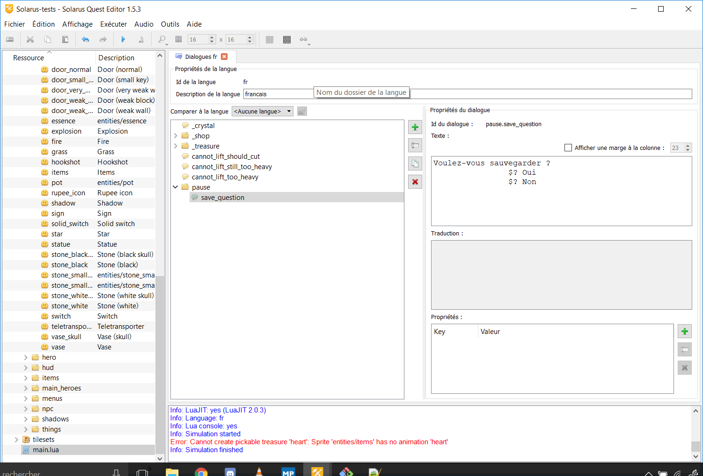
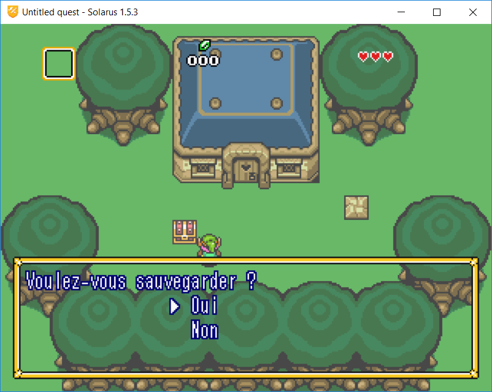

# Chapitre 9 - Sauvegarder une quête #

Bon, aujourd'hui, on code. On ne l'avait pas beaucoup fait depuis le début, mais pour ce chapitre, on va vraiment s'y mettre.

## I) La pause ##

Dès la création d'un projet, il est possible de mettre le jeu en pause en appuyant par défaut sur la touche <kbd>D</kbd>. Cette action ne provoque pour le moment qu'un "gel" du jeu, c'est à dire un blocage de la réception des événements claviers. Un deuxième appui sur la touche <kbd>D</kbd> relance le jeu.

### 1) Afficher un message lors de la pause ###

Tout d'abord, commencez par créer un nouveau dialogue qui correspondra à un message qui s'affichera à l'appui sur la touche de pause. Dans ce tuto, l'ID du dialogue sera `pause.save_question` vu qu'on cherchera a effectuer une sauvegarde.

Le script de la boite de dialogue dans les ressources ALTTP vous permet de signaler l'emplacement d'un curseur grâce à la syntaxe "$?". Ainsi, votre message pourra ressembler à la première image dans l'éditeur et à la seconde dans le jeu

 
//images a ajouter

Allez ensuite dans le script `game_manager.lua` et ajoutez <b>à l'intérieur de la fonction game\_manager:start\_game()</b> une fonction game:on_paused().

A l'intérieur de cette fonction, appelez la fonction `game:start_dialog("[id de votre dialogue]")`.

Maintenant, si vous lancez le jeu et que vous appuyez sur <kbd>D</kbd>, votre boite de dialogue devrait s'afficher, et vous devriez pouvoir sélectionner un choix. Cependant, une fois ce dialogue clos, votre personnage ne pourra toujours pas bouger car le jeu est toujours considéré comme figé. Appuyer une nouvelle fois sur <kbd>D</kbd> le remettra en mouvement.

La fonction start_dialog() peut également prendre un deuxième paramètre qui sera une fonction (anonyme ou non) prenant en paramètre une variable, correspondant à la ligne sur laquelle se trouve le curseur à l'appui sur la touche d'action (<kbd>espace</kbd> par défaut).

Du coup, pour l'instant, vous devriez avoir quelque chose comme ceci : 

	function game\_manager:start\_game(file\_name)  
	(...)  
		function game:on\_paused()
			game:start\_dialog("[id du dialogue]", function(answer)

        	end  
		end  
	(...)
	end

On va maintenant pouvoir désactiver la nécessité de réappuyer sur la touche de pause une fois la boite de dialogue fermée : à l'intérieur de votre dernière fonction, ajoutez la ligne `game:set\_paused(false)`.

Maintenant, si vous relancez le jeu et que vous ouvrez la boite de dialogue puis que vous la refermez, le héros pourra bouger directement, sans manipulation supplémentaire.

### 2) Sauvegarder la partie ###

Dans notre dernière fonction, nous avions parlé d'un paramètre correspondant au numéro de la ligne sur laquelle notre curseur est affiché. Dans notre cas, il pourra se situer sur les lignes 2 et 3, la ligne 2 étant celle qui permettra de sauvegarder la partie.

A l'intérieur de notre fonction, ajoutons donc un code pour préciser au moteur que si le curseur est sur la ligne 2, il sauvegardera la partie. La fonction de Solarus pour faire cette action est la fonction game:save().

Je vous laisse essayer de faire cette partie, la solution est juste en dessous.

Solution : 

>!if answer == 2 then  
	game:save()  
	end

On peut également ajouter un son en utilisant la syntaxe `sol.audio.play_sound("[nom du son]")`

Pour tester si votre système de sauvegarde fonctionne correctement, vous pouvez utiliser la technique suivante :

Normalement, si vous avez suivi le chapitre précédent, vous aviez créé un buisson en objet ramassable. Si vous le récupérez, que vous sauvegardez, quittez le jeu et que vous le relancez, vous devriez toujours l'avoir. Sinon, c'est que quelque chose s'est mal passé, reprenez cette partie du tutoriel.

Vous pouvez également faire de même avec l'épée. Pour la tester, retirez les lignes `set_ability[...]` du fichier "game\_manager.lua" et essayez d'ouvrir le coffre la contenant.

### 3) Le fichier de sauvegarde ###

Toutes les données que vous avez sauvegardées sont stockées dans un fichier (par défaut, `save1.dat`, comme indiqué dans le code du fichier `main.lua`), qui est situé dans les répertoires suivants selon votre système :
Sous Windows : `C:\Users\[nom d'utilisateur]\.solarus\[nom de la quête]`  
Sous Linux : `/home/[username]/.solarus/[nom de la quête]`  
Sous Mac : `/Users/[username]/.solarus/[nom de la quête]`

Toutes les données sont écrites de manière lisible, et donc facilement vérifiables. Les variables dont le nom commence par un _ sont celles gérées par le moteur. Les autres sont celles que vous gérez directement depuis votre code.

Voilà, nous sommes au bout de ce chapitre, vous savez maintenant comment sauvegarder votre partie et modifier vos données.
